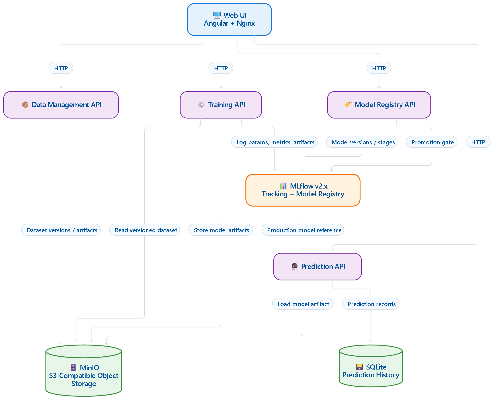

# CatDogClassifier — MLOps Platform

Run the whole platform from published Docker images. No build step needed.

## Architecture



## Requirements

- Docker with Docker Compose v2 (`docker compose` command)
- Internet access to pull the images from Docker Hub

## Run

```bash
docker compose up -d
```

The first run downloads the images (the training/prediction TensorFlow images are large,
~2.8 GB each). To follow startup logs instead of detaching:

```bash
docker compose up
```

Wait until every service is up (`docker compose ps` shows all services `Up`/`running`).

## Verify in the UI

Open the web UI:

- **UI**: http://localhost:4300

Supporting services you can also check:

| Service             | URL                   | Description                                                          |
| ------------------- | --------------------- | -------------------------------------------------------------------- |
| Data management API | http://localhost:8100 | Ingest and version datasets (DVC-backed, stored in MinIO).           |
| Training API        | http://localhost:8101 | Train the CatDogClassifier model and log runs to MLflow.             |
| Model registry API  | http://localhost:8102 | Version, stage, and promote models (Pending → Staging → Production). |
| Prediction API      | http://localhost:8103 | Serve the current Production model for inference.                    |
| MLflow              | http://localhost:5000 | Track experiments, runs, artifacts, and the model registry.          |
| MinIO console       | http://localhost:9003 | S3 storage web console (login `minioadmin` / `minioadmin`).          |

## Stop

```bash
docker compose down
```

Add `-v` to also wipe all stored data (datasets, models, predictions):

```bash
docker compose down -v
```
